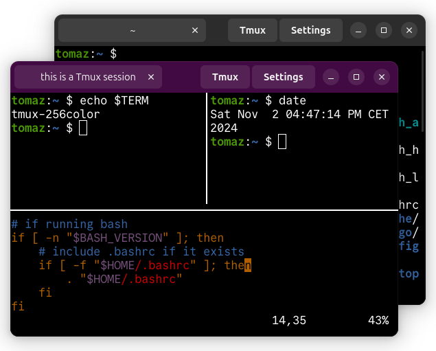

<h1 align="center">ivyTerm - Linux terminal with Tmux control mode integration</h1>

<p align="center">
  
</p>

## About
ivyTerm is a terminal emulator written in `gtk4-rs` with Tmux control mode integration. Created in the spirit of Terminator terminal, but it also lets you use local and remote (SSH) Tmux sessions directly from the terminal. Instead of having to configure Tmux on each remote host, ivyTerm will use Tmux's control mode to forward all keyboard input and keybindings to the remote Tmux session. In theory, you should notice no real difference between a local terminal session and a remote terminal session running through Tmux.

## Installation
Dependencies (GTK 4, libadwaita and VTE):
```
sudo apt install libgtk-4-dev build-essential
sudo apt install libvte-2.91-gtk4-dev
sudo apt install libadwaita-1-dev
```
Build ivyTerm
```
cargo build --release
```
